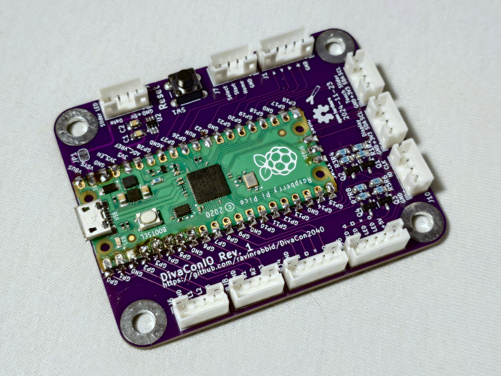

# DivaConIO - Main Board for the DivaCon2040

This board hosts a RaspberryPi Pico (or similar) microcontroller unit. It provides break out connectors for the GPIOs as well as signal shifting for WS2812 style LEDs and LED drivers for four single LEDs.

## Notes

- VBUS and VSYS are bridged as recommended in [Pico Datasheet Capter 3.5](https://datasheets.raspberrypi.com/picow/pico-w-datasheet.pdf). If you want to add external power, you can cut *JP1* to un-bridge.
- For powering active switches, like the Shinsanwa, 5V power is available on *J10*.
- If you don't need level shifting the for slider LEDs, you can omit *U2*, *C1* and *C2* and bridge *JP2* instead.

## Bill of Materials

| **Reference**           |                **Description**                |        **Digikey Part**         |                                        **Notes**                                         |
| ----------------------- | :-------------------------------------------: | :-----------------------------: | :--------------------------------------------------------------------------------------: |
| U1                      |               Raspberry Pi Pico               |        2648-SC0915CT-ND         | Other variants like the Pico W or Pico 2 should also work. Debug pins might not line up. |
| U2                      | 74LVC1T45 Dual supply translating transceiver |         1727-4560-1-ND          |                     Can be omitted if you don't need level shifting                      |
| Q1, Q2, Q3, Q4          |             BC847 NPN Transistor              |        BC847BLT3GOSCT-ND        |                                                                                          |
| C1, C2                  |          0.1µF SMD Ceramic Capacitor          |         1276-1003-1-ND          |                     Can be omitted if you don't need level shifting                      |
| R1,R2,R3,R4,R5,R6,R7,R8 |              4.7kΩ SMD Resistor               |    2019-RK73H2ATTD4701FCT-ND    |                                                                                          |
| J1,J4,J5                |       SWH201 Vertical 5 Pin Header 2mm        |            S9450-ND             |                       S9417-ND plus S9475CT-ND is the counterpart                        |
| J2,J3,J6,J7,J8,J9,10    |       SWH201 Vertical 4 Pin Header 2mm        |            S9457-ND             |                       S9406-ND plus S9475CT-ND is the counterpart                        |
| SW1                     |                Tactile Switch                 | 2223-TS02-66-60-BK-100-LCR-D-ND |                                         optional                                         |
