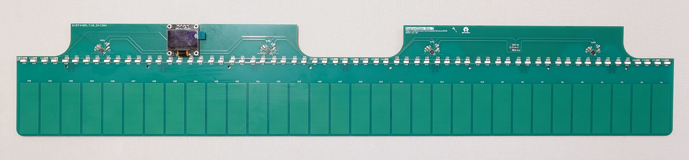

# DivaConSlider - Mpr121 based touch slider for the DivaCon2040

This board hosts four MPR121 capacitive touch controllers along with the slider electrodes and LEDs for illumination.

## Notes

- The Display module can be installed optionally.
- Dimensions are not arcade accurate.

## Bill of Materials

| **Reference**              |             **Description**              |     **Digikey Part**      |                                  **Notes**                                   |
| -------------------------- | :--------------------------------------: | :-----------------------: | :--------------------------------------------------------------------------: |
| U1-U4                      |        MPR121QR2 Touch Controller        |           n.a.            |    Discontinued, still available on marketplaces like eBay or AliExpress.    |
| D1-D64                     |           SK6812B SIDE RGB LED           |       1528-4691-ND        |                                                                              |
| C1-C72                     |       0.1µF SMD Ceramic Capacitor        |      1276-1003-1-ND       |                                                                              |
| R1,R3,R5,R7,R9,R10,R11,R12 |            10kΩ SMD Resistor             | 2019-RK73H2ATTD1002FTR-ND | R11 and R12 are only needed if the Display module does not have i2c pull-ups |
| R2,R4,R6,R8                |            75kΩ SMD Resistor             | 2019-RK73H2ATTD7502FTR-ND |                                                                              |
| R13                        |            470Ω SMD Resistor             | 2019-RK73H2ATTD4700FTR-ND |                                                                              |
| J1,J2,J3                   |     SWH201 Vertical 4 Pin Header 2mm     |         S9457-ND          |                 S9406-ND plus S9475CT-ND is the counterpart                  |
| J4                         | 0.96" SSD1306 128x64 OLED Display module | 3190-DLC0096DNOG-W-10-ND  |                                   optional                                   |
